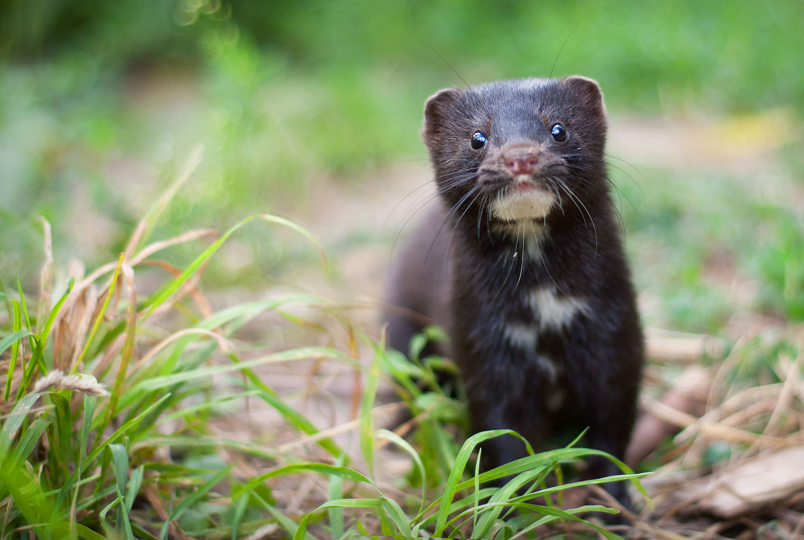

# Minks


**Minks** ("missing links") predicts and suggests missing connections in Obsidian knowledge graphs using structural and semantic similarity algorithms.

**Authors:** Caellum Yip Hoi-Lee, Catherine Abdul-Samad, Michael Chen, Joshua Yeung

## Setup

1. **Set up a virtual environment:**
   ```bash
   python3 -m venv venv
   source venv/bin/activate 
   ```
2. Install dependencies:
    ```bash
    pip install -r requirements.txt
    ```

3. Prepare the data:
Unzip your vaults archive so that the vault_a and vault_b folders are located inside the src/vaults/ directory.

## Usage
Run the `main.py` to load the vaults, tune the weights, and generate link predictions. Visualizations will be saved to the output/ folder.

``` bash
python3 main.py # Run with default Sentence-BERT embeddings:
python3 main.py --use-tfidf # Run with the custom TF-IDF fallback
```
